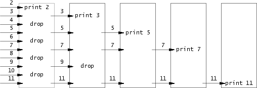
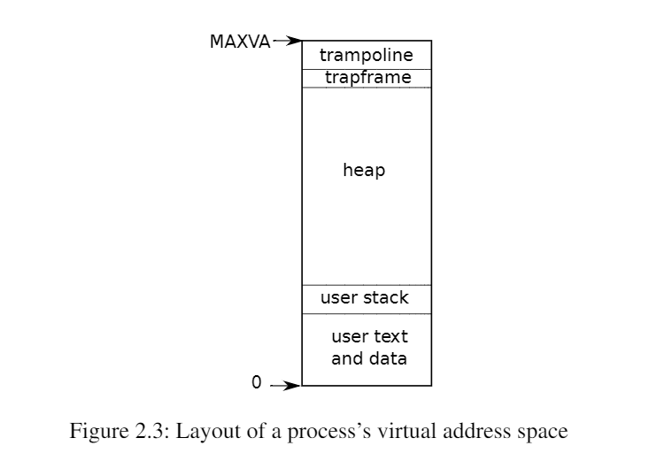
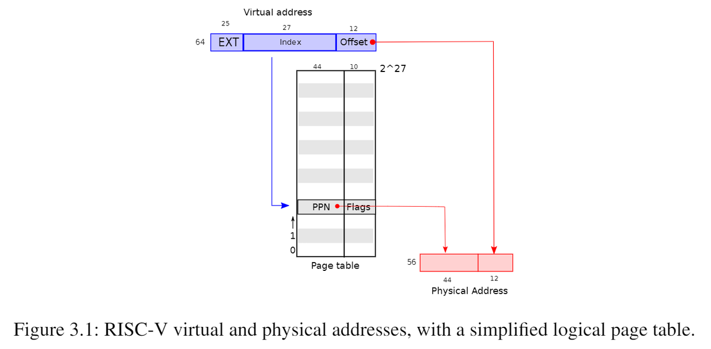
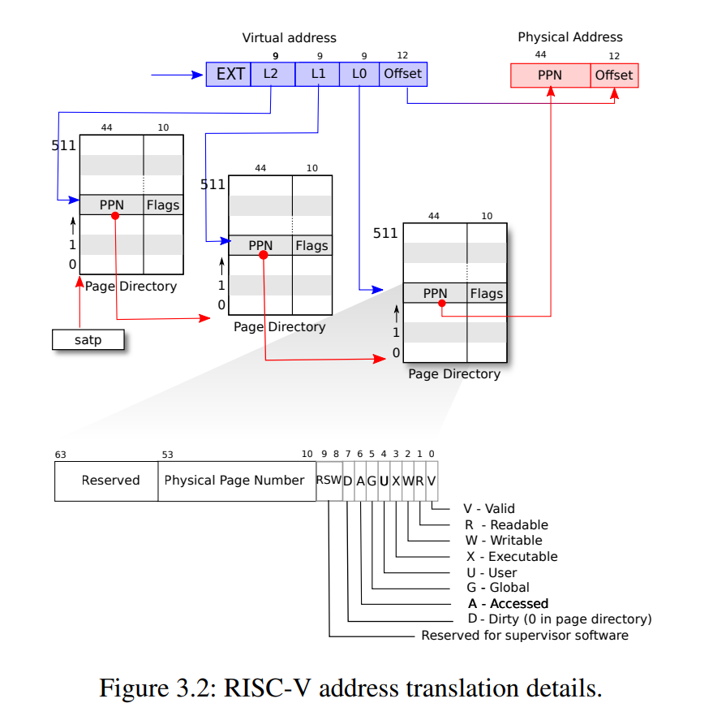
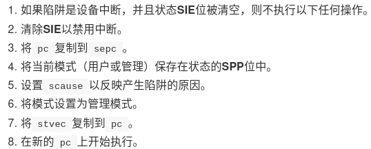
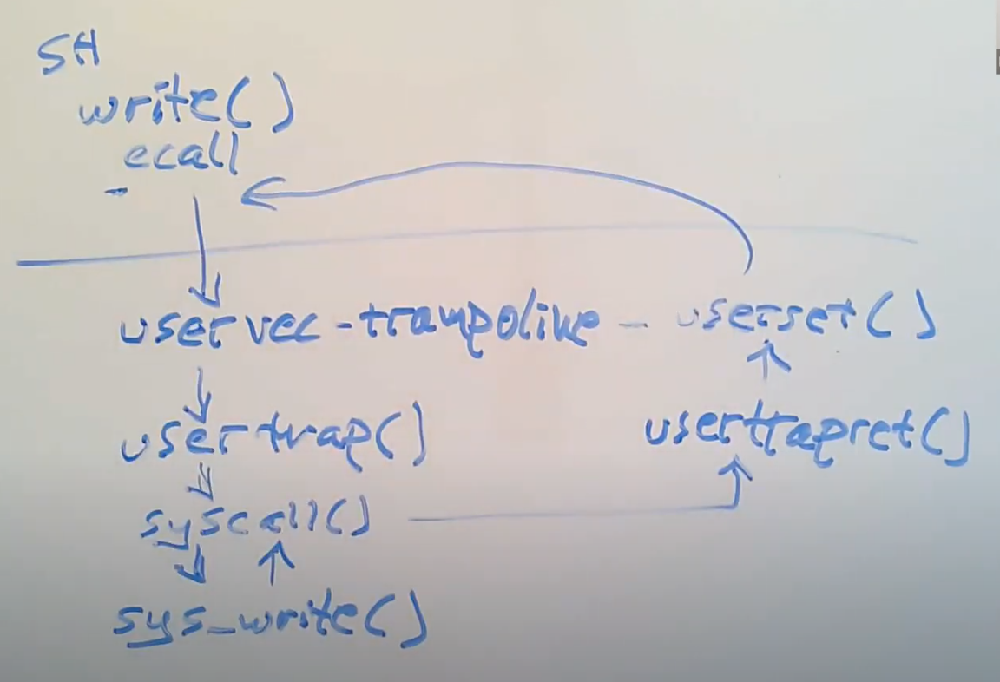
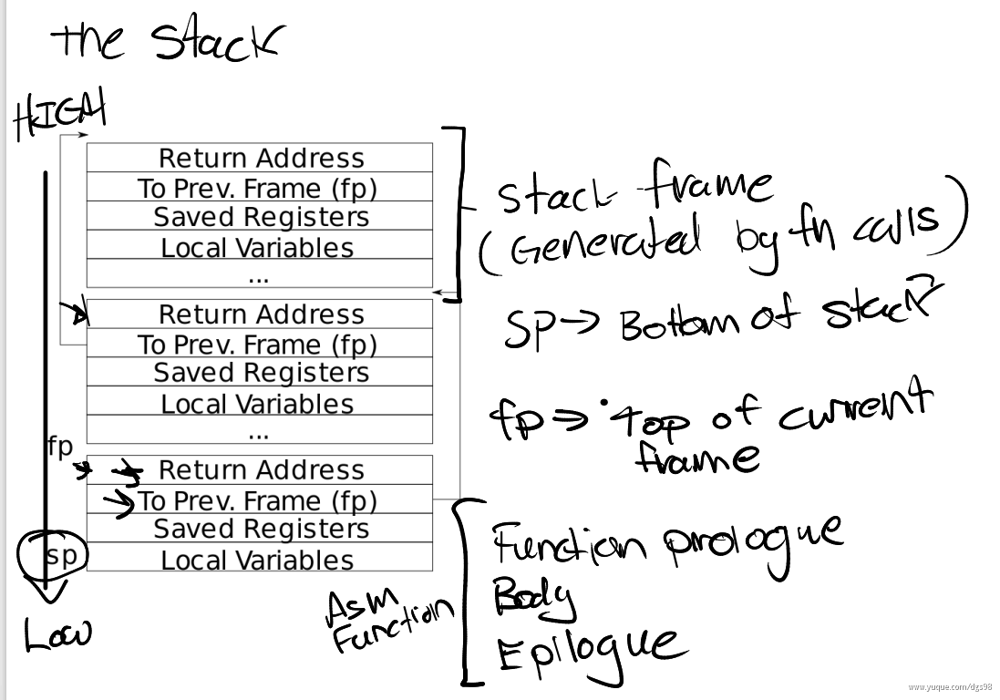
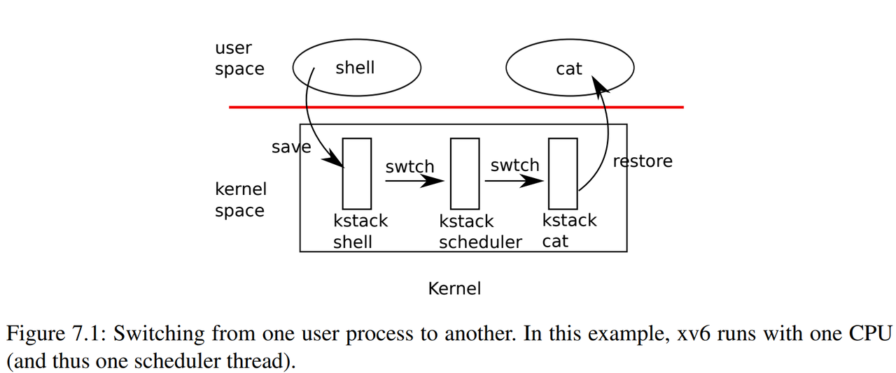

# Report

## lab1: util

### 阅读笔记

#### 1.1 进程与内存

1. fork
创建一个所有内容和父进程相同的子进程，但返回值不一样(父进程返回子进程的PID，子进程返回0)。
2. exit
传入0表示成功，1表示失败。
3. wait
当一个子进程终止时，父进程若未终止，则将自己的state设置为ZOMBIE。wait的系统调用会查找所有的ZOMBIE的进程，收回其资源。如果子进程没有退出，则等待。若没有子进程，则返回-1。传入一个地址，接收退出状态。
4. exec
从文件系统加载可执行文件进入进程并执行，该命令后面的指令在exec正确执行的情况下将不会执行。

#### 1.2 I/O和文件描述符

0: 标准输入
1: 标准输出
2: 标准错误

1. read(fd, buf, n)
从文件描述符fd读取最多n字节，将其复制到buf,返回读取的字节数。
2. write(fd, buf, n)
将buf中的n个字节写入文件描述符，并返回读取的字节数。只有发生错误时才会写入小于n字节。
3. close
释放文件描述符，父进程与子进程共享基础文件偏移量

    ```c
    if (fork() == 0) {
      write(1, "hello ", 6);
      exit(0);
    } else {
      wait(0);
      write(1, "world\n", 6);
    }
    ```

    ```text
    hello world
    ```

4. dup
复制一个现有的文件描述符，共享偏移量(与上方fork类似)

#### 1.3 管道

1. pipe一个int[2]的数组用以创建管道
2. 使用read和write对管道进行读写
3. 管道的read如果没有可用数据会一直等待，直到有新数据写入或写入端文件描述符关闭。

#### 1.4 文件系统

1. mkdir 创建新目录
2. open 中若使用 O_CREATE 创建新的数据文件
3. mknod 创建新的设备文件(一个主设备号和一个次设备号唯一标识一个内核设备)
4. 一个文件可以link到多个名字，文件底层是inode保存的。如果两个名字link到同一个文件，则其中的ino(指向inode的编号)相同。

### 题目

#### sleep

主要修改 user/sleep.c

参数argc为传入参数的数量，argv为实际的参数。

直接调用函数即可。

#### pingpong

主要修改 user/prime.c

在此处有可能出现死锁问题(见上方read的等待)。

解决方案: 尽早关闭不需要的描述符。

#### primes

主要修改 primes.c

主要使用了埃氏筛的思想。第一个传入的数字是2，然后把2的倍数全部筛掉，之后3是素数，把3的倍数全部筛掉……到最后可以获取全部的素数。



在此处要求使用进程间通信的方式实现，伪代码如下:

```text
p = get a number from left neighbor
print p
loop:
    n = get a number from left neighbor
    if (p does not divide n)
        send n to right neighbor
```

对于进程的创建，需要设计一个递归函数(便于实现，未考虑非递归算法)，退出条件为没有从左面的进程中获取到新的数字(已经筛选完了)。

对于内存的限制，依旧只需要一用完就关闭即可。

#### find

主要修改 user/find.c

主要使用了 ls.c 中的内容，没有大的修改。

#### xargs

该题只需了解清楚xargs的作用，了解清楚题意，则剩下工作较为简单。

了解清楚题意后，写代码更多的是调试指针方面的操作。

- 题目解读
  - 命令行参数
  
    ```text
    mkdir a b c
    a b c 即为参数
    ```

  - 标准化输出

    ```text
    grap a

    匹配输入的字符中是否有a
    命令输出的内容即为标准化输出

    例如，输入
    grap a
    abc
    则标准化输出为 abc
    ```

  - 管道符
  
    ```text
    cmda | cmdb
    将cmda中的输出作为cmdb的输入

    例如 find go | grep demo
    寻找go文件夹中所有包含demo的文件
    ```

  - xargs
  
    ```text
    cmda | xargs cmdb
    cmda的输出会作为cmdb的命令行参数

    例如 echo hello | xargs echo hi
    输出为 hi hello
    ```

- 代码实现三步走
  - 首先，获取前一个命令的标准化输出
  - 之后，获取这个命令的命令行参数
  - 最后，把这两个拼起来，并执行

具体实现在xargs.c中已经很详细了。

## lab2: syscall

### 阅读笔记

这部分要求阅读的内容都非常理论性，因此在此处只标明以前课程中记忆不深刻的，并且在此处说明系统调用的全过程。

#### xv6进程概述

1. 使用页表将虚拟地址映射为物理地址。每个进程都有一个独立的页表，定义了该进程的地址空间。

如图所示，用户地址空间从0开始，最大地址为MAXVA，在地址空间的顶部，有一个trampoline和trapframe分别占用了一页。
2. 每个进程有一个用户栈区和一个内核栈区，当进程在用户指令时，内核栈为空，当执行内核指令时，用户栈保留数据，但不在活跃状态。
3. 使用argint等内容从用户态获取对应的参数。
4. 用户态和内核态的指针不一样，需要使用copyout等方法，找到用户态指针对应的真正的物理地址。

#### 系统调用流程

1. 若在user.h中声明了一个函数，则可以调用它(在别处定义)。但是这样就必须在用户态中执行，因此，不在其中定义，而是想办法在usys.S中调用ecall指令，来到内核态。
2. 根据在usys.S中调用ecall,来到内核态
3. 所有系统函数在syscall()中处理，这个函数根据跳板传入的系统调用编号，找到对应的内核函数的位置。
4. 到具体的位置去执行对应的函数。

注意，usys.S由usys.pl生成。

### 题目

#### system call tracing

思路: 在syscall()中打印相关的内容，掩码在proc的struct中(proc.h)定义即可，在fork(proc.c)的时候复制过去，这样就能在子进程中也保留相关的信息。

#### sysinfo

思路: 定义get_freememory()函数(kalloc.c)来获取空闲内存，定义get_nproc()函数(proc.c)来获取进程数。

在此需要了解空闲内存的组织方式和进程的组织方式。

1. 空闲内存页本身直接用作链表节点，每次分配的时候，把链表根部的页分配，回收时把这个页面作为根节点。因此，只需要遍历链表并计数即可。
2. 进程有一个proc table管理(类似于进程池)，里面有使用了的和未使用的进程。因此，只需要遍历这个进程池，找出所有使用了的进程即可。

## lab3: pgtbl

这个实验比较困难，目前没有完美地做完，因为未知的原因，有的时候可以过，有的时候过不了(在usertests处)。并且，由于内核调试比较困难，参考了许多网上的代码，但是问题并没有解决。并且一直使用的print的方式由于异步而效果不好，而本人又对gdb不是非常熟悉，因此只能暂时搁置。下面附上一张通过的图片。


### 阅读笔记

#### 3.1 分页硬件

1. 页表硬件将虚拟地址映射为物理地址。
2. xv6只使用64位虚拟地址的低39位，页表逻辑上有2^27个页表条目(PTE)。每个PTE包含一个44位的物理页码(PPN)和一些标志。页表的逻辑示图如下。由图可知，页面大小为2^12字节，物理地址有56位。
  
3. 页表实际的转换分三个步骤进行。页表实际的结构是一个三级的树。树根是一页(4096byte)，其中包含512个PTE(8byte)。每个PTE包含该树的下一级页表页的物理地址。实际的过程如下图所示。
  
4. 根页表页的物理地址在satp寄存器中。每个cpu都有一个satp。

#### 3.2 内核地址空间

1. xv6为每个进程维护一个页表，内核公用一个页表。
2. 绝大多数虚拟地址都采用直接映射的方式，除了蹦床页面(trampoline)和内核栈页面(保护栈)

#### 3.3 代码: 创建一个地址空间

1. walk
为虚拟地址找到PTE
2. mappages
为新映射装载PTE
3. copyout/copyin
复制数据到用户虚拟地址/从用户虚拟地址复制数据
4. inithart相关
将根页表页的地址写入satp

#### 3.5 代码: 物理内存分配

1. 分配器的数据结构是一个物理内存页的空闲页表。
2. 地址有时以指针存在，有时以uint64存在。
3. kfree将内存的每个字节设置为1。
4. kalloc分配一个页面

#### 剩余部分

1. sbrk
进程减少或增长内存。
2. exec
使用一个存储在文件系统中的文件初始化地址空间的用户部分。使用proc_pagetable分配新页表，使用uvmalloc分配内存，使用loadseg将内容读进来。

### 题目

#### Print a page table

vm.c 中添加 vmprint_aux 函数以及 vmprint 函数来打印页表。

定义了 level 的数组来帮助输出级别。

vmprint 函数打印第一行的参数，然后调用辅助函数打印具体的页表

vmprint_aux 函数使用深搜的方式打印整个页表

#### A kernel page table per process

这个题目要求每个进程进入内核态后，都有自己独立的内核页表。

本题目应该是正确完成了(多次测试usertests均正确)

1. 首先修改struct proc，添加内核页表项 kernelpgtbl (proc.h)
2. 修改kvminit以及相关的函数，并消除相关的影响
    1. 内核中有一些固定的映射，因此将其抽象出函数 kvm_map_pagetable(pagetable_t)。(vm.c)
    2. 抽象出函数kvminit_newpgtbl，返回一个正确的页表。kvminit函数只需要调用这个函数即可。(vm.c)
    3. 修改kvmmap和kvmpa函数，添加第一个参数pagetable_t,便于之后的操作。(vm.c)
    4. 在virtio_disk_rw函数中，调用了kvmpa函数，且与本实验无关，进行处理即可。(virtio_disk.c)
3. 经过以上的操作，可以分配内核页表了。但是，在同一时间内，可能有多个进程同时处于内核态。在原先的设计中，公用一个内核页表，于是需要为不同进程创建多个内核栈，然后map到不同的地方。(见下图Kstack0和Kstack1)
  
  在修改之后，每个进程都有自己的内核页表，因此只需要map出自己的内核栈即可。因此进行如下操作：
      1. 修改procinit函数，删除创建内核栈的代码。(proc.c)
      2. 在allocproc函数的时候，除了创建kernelpgtbl之外，把内核栈映射到一个确定的位置。(proc.c)
4. 经过以上操作，我们现在可以正确创建页表了。在之后，我们还需要在进程调度时，切换页表。(proc.c/scheduler)
5. 在进程结束后，释放页表(proc.c/freeproc)。在此处，绝对不能使用proc_freepagetable函数(会连带物理页一块释放)和kfree函数(只释放一级页表，造成泄漏)。因此，添加函数kvm_free_kernelpgtbl函数(vm.c)，通过递归的方式释放页表。

经过以上的操作，本实验可以正确完成。

#### Simplify copyin/copyinstr

在这个实验做完后，有时无法通过usertests测试。因此在此只给出自己实现的步骤和理由，但是此部分不保证正确。

1. 两个工具函数:
    1. kvmcopymappings(vm.c)
    将src页表的一部分映射关系(从start到end)拷贝到dst页表中，不拷贝实际的物理内存。成功返回0，不成功返回-1
    2. kvmdealloc(vm.c)
    将程序内存从oldsz缩减为newsz,不释放实际内存。
2. 要解决一个问题。实验中要求，映射的内存地址为0到PLIC，但是这两个之间有一个CLINT的映射。这就产生了冲突。查阅多方资料可知，CLINT仅在内核启动的时候需要使用，因此kvm_map_pagetable()函数中，去除CLINT的映射，在全局页表的初始化(kvminit)中，单独映射。
3. 在exec中检查，避免超过PLIC(exec.c)
4. 在fork(), exec(), growproc()函数中，只要修改了页表，就拷贝到内核页表里面
5. 最后，在userinit(proc.c)函数中，也添加同步映射的代码。

## lab4: traps

### 阅读笔记

#### 4.1 RISC-V陷入机制

一组处理陷阱的寄存器，只能在内核模式下读取或写入。

1. stvec: 保存内核处理陷阱程序的地址
2. sepc: 发生陷阱时，将pc复制到这里。返回时，将这里复制到pc
3. scause: 保存陷阱原因
4. sscratch: 在之后说明
5. sstatus: SIE位控制中断是否启用。SPP位指示陷阱来自用户还是内核。

#### 4.2 从用户空间陷入

1. 几种情况: 用户发出系统调用(ecall)、做了非法的事情、设备中断。
2. 在陷阱的时候不会切换页表，因此必须在用户页表包含uservec(stvec指向的指令)，并且uservec中必须切换satp以切换到内核页表，uservec必须在内核页表和用户页表映射到相同的地址。
3. 以上约束通过trampoline page来满足。映射到的相同地址为 TRAMPOLINE
4. sscratch寄存器的作用是帮助uservec修改一些寄存器的值。在最开始的时候，交换寄存器a0和sscratch的值，uservec可以使用a0寄存器，此时a0中包含了之前sscratch的值。而之前sscratch的值为指向一个陷阱帧的指针，这个帧里面保存了所有用户寄存器。所以此时，uservec就可以在其中保存现场了。

以上内容大致讲述了一些操作中容易迷惑的原理，至于具体的陷入的流程，为了更加清晰，将在下面单独开一个部分来阐述。

#### 4.5 从内核空间陷入

1. 几种情况: 设备中断、异常。
2. 如果由于计时器中断并且一个进程的内核线程正在运行，那么会调用yield来进行调度。

#### 具体陷入流程

以系统调用为例，其余类似。

1. ecall指令(或者导致陷入陷阱的操作)
    
2. uservec函数(trampline.S)
    1. 保存现场
    2. 切换页表、kernel stack
    3. 跳转到usertrap
3. usertrap函数(trap.c)
    1. 修改stvec的值到kerneltrap,再有trap会到那里执行。
    2. 保存sepc的值
    3. 分情况处理(在此处处理系统调用)
4. usertrapret函数(trap.c)
    1. 恢复stvec和sepc的值
    2. 更新trapframe中的值，以便下次的陷入使用
5. userret函数(trampoline.S)
    1. 恢复现场
    2. 把trapframe的内容保存到sscratch中，恢复到用户的pagetable和stack
    3. 跳转到sret
6. sret指令
    1. 切换回user mode
    2. SEPC的寄存器拷贝到PC寄存器
    3. 打开中断



### 题目

#### RISC-V assembly

答案见answers-traps.txt

#### Backtrace

1. 按照提示，在riscv.h中添加读取s0寄存器的函数，在printf.c中添加backtrace()的函数，并在sys_sleep中调用。之后解读backtrace的实现。
2. backtrace的目的是打印函数调用栈的地址。需要参考如下栈的布局:
  
  由图可知，栈的返回地址记录在-8到0的位置(首地址为-8)，类似的，栈里面有一个指针指向上一个调用栈，首地址为-16。因此，在循环中，只需要读到当前的栈，然后循环中不断打印返回地址，走到上一个栈即可。根据提示，循环终止条件由页面的顶部地址和底部地址决定。

#### Alarm

按照题意，添加的sigalarm函数，每次经过interval的时间，就调用handler。

1. 在proc中添加项目，ticks表示等待的时间，tick_count表示已经经过的时间，handler记录函数，old_trapframe用于恢复原状。(proc.h)
2. 在sys_sigalarm中实现这些变量的修改。注意这里需要重置之前记录的时间(修改后过去的时间应该无效)。(sysproc.c)
3. 在allocproc()函数中实现初始化，在freeproc()函数添加逻辑以释放。(proc.c)
4. 在usertrap中对于时钟周期的中断添加逻辑。(将原先的内容保存，将需要执行的内容写入epc中，这个东西一会会在返回的时候写到pc中，然后会从这个地方继续执行。)
5. 在sys_sigreturn()函数中实现返回的逻辑(sysproc.c)，需要将保存的trapframe存回去，之后就可以在返回的时候执行原来的逻辑。

注意，防止重新进入在以上的代码中已经实现了，实现途径如下:

将重置tick_count的代码写在sys_sigreturn()里面。也就是说，如果不执行sys_sigreturn()，那么tick_count会一直增加，永远不会满足tick_count == ticks的逻辑，从而不会重新进入。

## lab5: lazy

### 阅读笔记

这部分要阅读的内容比较偏理论，并且比较少，因此我在此部分书写这个实验的原理。下面的lab6同理。

1. 原有逻辑
  
2. lazy allocation
  

### 题目

这个实验的前后题目间关联性较强，因此当作一个题目处理，一起写实现的逻辑。

1. 首先，修改sys_sbrk()函数(sysproc.c)，去除增长内存的逻辑growproc，只将大小增大。(如果是内存减小，则直接完成即可)
2. 在usertrap()函数中增加处理因为懒分配而产生的缺页错误。(trap.c)具体操作为，如果遇到缺页错误，那么则检查是否为懒分配，如果是懒分配，就给他分配内存。具体用到一下两个工具函数:
    1. is_lazy_alloc_va(proc.c)
    检查是否为懒分配，在此需要处理两种情况。第一种是虚拟地址大于进程大小，那么一定不是懒分配。第二个是所给的内存在栈的第一页中(这一页不分配，用来处理stack overflow)，懒分配也不应该在这个地方进行。
    2. lazy_alloc(proc.c)
    参考uvmalloc中增长内存的逻辑，在只需要删去dealloc的逻辑即可(因为只分配一次，不用删除之前的分配以恢复原状)
3. 在涉及到缺页恐慌的时候，直接continue即可(默认这是懒分配的缺页，具体在trap中处理)。(uvmcopy, uvmunmap)
4. 现在还有最后一个问题，当系统调用是read或者是write的时候，(以write举例)，调用栈如下:

    1. sys_write
    2. filewrite
    3. pipewrite
    4. copyin
    5. memmove

    其中，copyin的作用为，把从源地址的len个长度拷贝到dst的位置上。这个操作是通过memmove传入两个地址，然后直接通过字节流的方式拷贝的。但是，源地址是用户空间传来的虚拟地址，需要一个转换成物理地址的过程，在此处直接通过walkaddr转换。但是，由于懒分配，我们很可能找不到这样的物理地址。因此，直接修改walkaddr函数，在其中完成懒分配即可。

## lab6: cow

### 阅读笔记

cow: copy on write

对于fork

- 原先逻辑: 将父进程的所有用户空间内存复制到子进程中
- cow: 在fork时，不进行实际的拷贝，只是将虚拟地址指向与父进程相同的物理地址。只有在设计修改操作时，才真正进行拷贝。

### 题目

1. 先在PTE的保留位中选一个PTE_COW记录是否为COW的页面。(riscv.h)
2. 新建一个ref数组(kalloc.c)，里面有一个int的cnt数组，记录每个页面的引用计数。同时，这里要处理读写冲突的问题(要加锁)。同时，在kinit()的时候初始化这个锁(kalloc.c)
3. 修改kalloc函数，在分配一页的时候将这一页的引用计数设置为1。(kalloc.c)
4. 修改kfree函数，在释放一页的时候将其引用计数减少。只有引用计数为0的时候，才释放内存。(kalloc.c)
5. 定义了两个工具krefcnt获取一个物理地址的引用计数，kadd_refcnt来增加引用计数。
6. 同样，在usertrap(trap.c)中处理cow引发的错误。需要两个函数is_cow_fault和cow_alloc
    1. is_cow_fault(vm.c)传入pagetable和虚拟地址，先获取页表项，然后进行简单的判断后返回结果(具体涉及PTE_V, PTE_U, PTE_COW)
    2. cow_alloc(vm.c)与上个实验不同的是，这里如果成功，会直接返回分配到的物理地址。具体的分配过程如下: 首先获取对应的物理地址和页表项(在这里不能使用PA2PTE，因为一个物理地址可能对应多个页表项)，然后检查引用计数的状态。如果为1，则将写权限还给他，并不认为这依然是一个COW的页面。如果不为1，则需要分配新的页面，并将旧页面引用计数减去。
7. 修改uvmcopy(vm.c)，在copy的时候，不分配内存，而是共享内存，并收回写权限，设置为COW的页面，并增加引用计数。
8. 修改freerange函数(kalloc.c)，这个函数的目的是把一段物理内存全部释放掉，因此我们直接将其引用计数设置为1，然后调用kfree将其释放即可。
9. 修改copyout()函数，在其中添加cow_fault的逻辑即可。

## lab7: thread

### 阅读笔记

#### 7.1 多路复用

将CPU从一个进程切换到另一个进程实现多路复用。切换情况如下:

1. 等待设备或管道IO
2. 等待子进程退出
3. 调用sleep等待
4. 强制切换长时间计算不睡眠的进程。

目的: 产生每个进程都有自己CPU的错觉

#### 7.2 代码: 上下文切换

在本节中研究内核线程到调度程序线程的切换。

1. 调度程序不能在旧进程的内核栈执行，因为别的内核可能重新唤醒旧进程，从而在两个核心保留了同一个进程的内核栈。因此，每个CPU都有一个专用的调度线程。如图所示:
  
2. 函数swtch用来执行线程的保存和恢复操作。在此处，上下文将会被切换为保存在cpu中的调度程序的上下文。

#### 7.3 代码: 调度

scheduler选择下一个要进行的进程。

这是一个简单的循环，找到一个可运行的程序，然后将上下文切换过去开始运行。

需要注意的有如下两个不变量:

1. 如果进程是running状态，那么yield必须可以安全地将其切换出去。(没有任何东西有这个东西的副本)
2. 如果进程是runnable状态，那么调度程序必须能安全地运行它。(p->context必须保存寄存器，且没有CPU在这个进程的内核栈上执行)

维护方法: 在一个线程中获取p->lock并在另一个进程中释放。

举例: yield函数将这个状态转换为runnable，因此这时锁被持有，并保持被持有直到scheduler调度完成，此时才释放锁。

#### 7.4 代码: mycpu和myproc

mycpu返回一个指向当前cpu的指针，但是这个返回值很脆弱，因为一旦发生了进程的切换，会导致原先的返回值失效。

myproc返回当前cpu运行的进程的指针，通过禁用中断后从cpu取回进程后启用中断实现。但是这个返回值是安全的，因为即使发生了进程的切换，这个指针也不会变。

#### 总结: 上下文切换流程


1. 先经过trap,保存用户空间的上下文，进入内核
2. 如果是时间片产生的中断，那么会将当前的cpu资源让渡，调用swtch函数进行上下文的切换，转到scheduler
3. scheduler寻找下一个可以执行的进程，然后通过swtch切换到那个进程去。
4. 返回用户空间，执行用户空间的程序。


### 题目

#### Uthread: switching between threads

1. 仿照swtch.S的内容，完成uthread_switch.S的内容。
2. 将context的定义拷贝到uthread.c，并在thread的定义中加入一个context
3. 在thread_schedule中调用thread_switch进行上下文的切换
4. 在thread_create中设置ra和sp的值。

#### using threads

1. 定义一个lock全局数组，并做好初始化
2. 在put中加锁即可。读不用加锁，因为不改。

#### Barrier

这个实现比较简单，如果进程数不相等，就一直等待。如果相等了，就唤醒所有进程，恢复初始状态即可。

## lab8: lock

### 阅读笔记

锁通过一些操作可以强制实现多核的串行。

#### 6.3 代码: 使用锁

xv6的kalloc.c分配器有一个由单个锁保护的空闲列表，同一时间只有一个cpu可以通过这个来分配内存。改进方法为使其拥有多个空闲列表。

#### 6.5 锁和中断处理函数

1. 锁和中断的交互可能会产生死锁。举例: clockintr定时器在处理中断的时候增加ticks，而sys_sleep会读取ticks，因此，加锁tickslock。但是，当sys_sleep持有tickslock时被中断，那么他将在持有锁的时候进入中断处理，并且在中断处理中请求锁tickslock。
2. xv6中，为了解决如上情况，当cpu获取锁的时候，会禁用这个cpu的中断。
3. 通过push_off禁用中断，pop_off恢复中断。同时，这两个函数通过计数的方式考虑了多层锁的情况。

#### 6.9 睡眠锁

由上述内容可知，由于禁用了中断，那么在获取了普通锁的时候不能让渡cpu。但是，有时操作时间过长，会浪费很多。因此，提供了sleep-lock。可以使用acquiresleep在等待时让渡cpu.

#### 8.2 Buffer cache层

bio.c

本层两个任务:

  1. 同步对磁盘块的访问，确保磁盘块在内存中只有一个副本，且只有一个内核访问
  2. 缓存常用块，加快速度

接口：

  1. bread: 获取一个buf,包含一个块的副本
  2. bwrite: 将修改后的缓冲区写回
  3. brelse: 释放缓冲区

这层使用的是睡眠锁，可以中断。使用LRU算法。

#### 8.3 代码: Buffer cache

1. 以双链表表示的缓冲区。使用bcache.head引用链表。
2. bread调用bget为扇区获取缓冲区。如果需要从磁盘读取，那么会调用virtio_disk_rw
3. bget扫描缓冲区列表，如果存在查询的缓冲区，则获取睡眠锁，然后返回这个缓冲区。如果没有缓冲区，那么会创建一个。这个操作先看能不能新建，如果不能，那么会扫描缓冲区列表，找一个引用计数为0的使用。
4. bget通过加锁的方式来确保每个磁盘扇区都最多有一个缓冲区。
5. brelse释放缓冲区，将缓冲区移动到链表的最前面。这样，链表的第一个缓冲区是最近使用的，最后一个缓冲区是最少使用的，bget中可以直接检查后面的缓冲区来进行简单地选择。
6. 通过睡眠锁保护缓冲区的读写。

### 题目

#### Memory allocator

1. 修改kmems,使其每个cpu都有一个。(kalloc.c)
2. 在kinit中初始化所有的锁，并调用freerange来调用kfree将页面加到链表中。(kalloc.c)
3. 修改kfree,关中断，在cpu操作，然后开中断。(kalloc.c)
4. 修改kalloc,如果当前cpu有空闲的，就用当前cpu的，如果没有，就遍历别的cpu,获取它们里面的空闲空间(一页)。(kalloc.c)

这样，在最初始的时候，某个(或某几个)cpu通过freerange将内存加入自己的链表中，然后别的cpu调用的时候会从这里获取内存，释放的时候加入到自己的链表中。

#### Buffer cache

这里逻辑较为复杂，特别是加锁的逻辑。因此将其单独分出一部分进行说明。

1. 首先修改buf结构体(buf.h)，去除不再需要的prev字段，添加timestamp字段记录最后使用的时间
2. 修改bcache结构体(bio.c)，添加size字段，记录缓存块数量，添加哈希表buckets,添加需要用的一些锁。
3. 在binit函数中初始化所有的锁。在此处，buf作为一个缓冲池使用。由于可以采用数组形式获取，故不需初始化链表。
4. 修改brelse函数，在释放时只需记录时间即可。
5. 修改bpin和bunpin函数，更换为bucket的锁即可。
6. bget函数的修改。在这里分两个部分。
    1. 分配的逻辑:
        1. 根据获取的idx在对应的哈希表中查找，如果找到则添加引用计数后直接返回。
        2. 如果没有找到，那么查看缓冲池是否有未使用的缓冲区。如果有，那么将其加入哈希表的头节点之后。修改参数后直接返回。
        3. 若是已经没有缓冲区了，那么使用LRU算法查找。从当前的bucket开始查找，找到当前bucket中引用计数为0并且timestamp最小的缓存块。如果有的话，就修改参数后返回(这里需要考虑不在同一个bucket的情况)，如果没有的话，就去其它的bucket中查找。因此，这里不是严格的LRU算法。
    2. 加锁的逻辑(bget)
        1. 在步骤1中，只需要遍历或修改一个特定的bucket，只需要对这个bucket加锁即可。
        2. 在步骤2中，由于会对size进行读取和更新，需要获取lock锁。且步骤1和2之间不能释放bucket的锁。因为一旦释放, 则可能有另一个线程对同一缓存块进行访问, 而此时第一个线程可能还正在分配, 缓存块还未更新到bucket链表中, 由于bucket的锁已经释放, 这样第二个线程可以遍历该bucket链表, 同样发现缓存块不存在则去申请分配，从而导致同一块会被多次分配。
        3. 在步骤2结束后，我选择将所有锁释放，将步骤3的分配作为一个独立的过程进行。因为步骤3需要遍历所有的bucket.如果不释放当前的bucket的锁，虽然可以确保同步，但是会占用大量的时间。而如果释放了，则只需要在遍历的时候加一个简单的判断即可统一所有的代码的表现。
        4. 在步骤3中，每次循环到一个bucket,需要对其进行加锁。但是一旦释放了当前bucket的锁，那么在遍历别的bucket的同时可能有另一个线程同样访问该缓存块，导致了重复的分配，因此需要在整个步骤3外面加一个hashlock进行保护。那么现在，情况如下: 有两个线程来获取hashlock锁，一个进入完成了分配，另一个等待分配后重新进入。因此，需要在此处重新检查是否已经有了目标缓存块(这也解决了3中提出的问题)。

## lab9: fs

### 阅读笔记

#### 8.4 日志层

xv6通过简单的日志记录来解决文件崩溃问题。

xv6的系统调用不会直接写入磁盘，而是在磁盘的日志中放入所有写入的描述，一旦完成了所有写入操作的记录，就向磁盘提交一条commit记录，此时再将写操作复制到磁盘上。最后会擦除磁盘上的日志。

如果系统发生崩溃并重启，那么文件系统将读取日志。如果日志为完整操作，则回复代码将写操作复制到文件系统中，如果不是完整操作，那么会忽略该日志。

#### 8.5 日志设计

日志由一个header block和一系列logged block组成，header block包含一个数组来记录每个logged block的扇区号，还有一个int来记录logged block的数量。

日志系统可以将多个系统调用的写入累积到一个事物中。

任何单个系统调用都不允许写入超过日志空间的不同块。如果必须超出，需要将写入分解为多个写入。

#### 8.6 代码: 日志

1. begin_op 确保日志系统当前不处于提交状态，并且有足够的日志空间。
2. log_write 将块的扇区号记录，在日志中预定一个位置，并且将缓存固定在block cache中(bpin)
3. end_op 减少未完成系统调用的计数。如果计数为0，那么会通过commit提交事物。

#### 8.7 代码: 块分配器

1. 块分配器在磁盘上维护一个空闲位图，0代表空闲。
2. balloc 分配一个新的磁盘块
3. bfree 释放一个块

#### 8.8 索引节点层

1. 磁盘上的inode都被保存在inode块的连续区域，每个inode大小都相同，因此，可以仅用一个编号来标识和获取一个inode。
2. 磁盘上的inode为struct dinode,type为0表示inode空闲。nlink统计引用此inode的目录条目。addrs记录保存文件内容的磁盘块的块号。
3. 内核会将活动的inode保存在内存中，struct inode是磁盘dinode的副本，ref记录引用内存中这个inode的数量。
4. iget返回的inode在iput调用之前保证有效，并且返回的inode可能没有有用的内容，此时必须调用ilock并从磁盘读取inode.

#### 8.10 代码: Inode包含内容

addrs数组的前NDIRECT个数据块是直接块，接下来的NINDIRECT个数据块称为间接块，在查阅间接块后才能加载真正的数据。


函数bmap用来分配块(先直接后间接)，itrunc释放文件的块(先直接后间接)

函数stati将inode元数据复制到stat结构体中，并通过stat系统调用向用户公开。

#### 8.12 代码: 路径名

函数namei计算path并返回相应的inode.

#### 8.13 文件描述符层

xv6为每个进程提供了自己的打开文件表或文件描述符。每个打开的文件用一个struct file表示(inode或管道的封装加上一个IO偏移量)。

open打开文件，如果多个进程打开同一相同文件，那么不同的实例将具有不同的IO偏移量。

所有打开的文件都在全局文件表ftable中。

### 题目

#### Large files

1. 在fs.h中更改宏定义，将直接块改为11，添加NDINDIRECT，记录二级间接块所包含的块数。
2. 由于NDIRECT的改变，修改所有相关的数组定义，确保大小不变
3. 修改bmap支持二级索引，在二级索引中，先获取第一级索引的id,再获取第二级索引的id,然后分层地进入去读取相应的内容。
4. 修改itrunc释放所有块，释放二级索引时，需要先释放第二级里面的内容，然后释放第一级对应的内容，防止内容丢失。

#### Symbolic links

1. 首先定义symlink的系统调用
2. 根据指导书要求，去stat.h和fcntl.h中添加两个新的标志指示链接类型。
3. 实现sys_symlink函数(sysfile.c)，分配一个inode节点，向这个节点中写入真正的路径。
4. 修改sys_open系统调用，避免循环的方式是设定一个阈值10。先通过readi读取符号链接指向的地址，然后再通过namei读取新的地址对应的ip,一直循环，直到找到真正的文件。

## lab10: mmap

### 题目

1. 先添加mmap和munmap的系统调用。
2. 在proc.h中定义NVMA以及vm_area结构体(用于表示mmap系统调用文件映射的虚拟内存的位置、大小、权限等)，并在struct proc中添加相关字段。每个进程都使用一个vma来记录映射的内存。
3. 在allocproc中将vma初始化为0。(proc.c)
4. 在sysfile.c中实现系统调用sys_mmap，先读取参数，然后根据题意做出相应的检查，如果检查通过，则寻找一个未使用的vma,将其赋值，然后添加引用计数后进行懒分配，返回其地址。
5. 在usertrap中处理懒分配的页面错误。如果出现错误的虚拟地址在合理的范围，那么就调用mmap_handler进行处理。首先找到对应的vma，然后检查权限错误，然后分配内存，将文件内容写入后，映射到页表中。(trap.c)
6. 实现系统调用sys_munmap,首先读取参数，然后找到要取消映射的vma。如果需要写回，就用filewrite写回，然后取消页表的映射。如果这个vma的所有映射都被取消，那么就将文件关闭(引用计数-1)。
7. 在uvmunmap和uvmcopy中，取消由懒分配导致的panic。(vm.c)
8. 修改exit,将已经映射的空间取消映射(proc.c)
9. 修改fork，复制父进程的vma(proc.c)

## lab11

### 阅读笔记

这个lab需要读的内容太多了，暂时没有全部看完，只看了一些网上的博客，然后根据博客的内容复现出这个实验并通过了测试。

<https://blog.csdn.net/LostUnravel/article/details/121437373>

总结:

操作系统想要发送数据的时候，将数据放入环形缓冲区数组 tx_ring 内，然后递增 E1000_TDT，网卡会自动将数据发出。当网卡收到数据的时候，网卡首先使用 direct memory access，将数据放入 rx_ring 环形缓冲区数组中，然后向 CPU 发起一个硬件中断，CPU 在收到中断后，直接读取 rx_ring 中的数据即可。

### 题目

1. e1000_transmit
    1. 首先需要获取锁，避免多进程同时发送数据出现冲突
    2. 获取下一个可用的buffer下标tail
    3. 如果buffer的数据没传输完，意味着缓冲区不足，返回错误即可。
    4. 设置参数
    5. 环形缓冲区下标+1
2. e1000_recv
    1. 一次recv可能接受很多包，因此采用循环。
    2. 调用net_rx传递给上层网络栈，上层释放mbuf
    3. 分配新的mbuf,供下一次使用。
